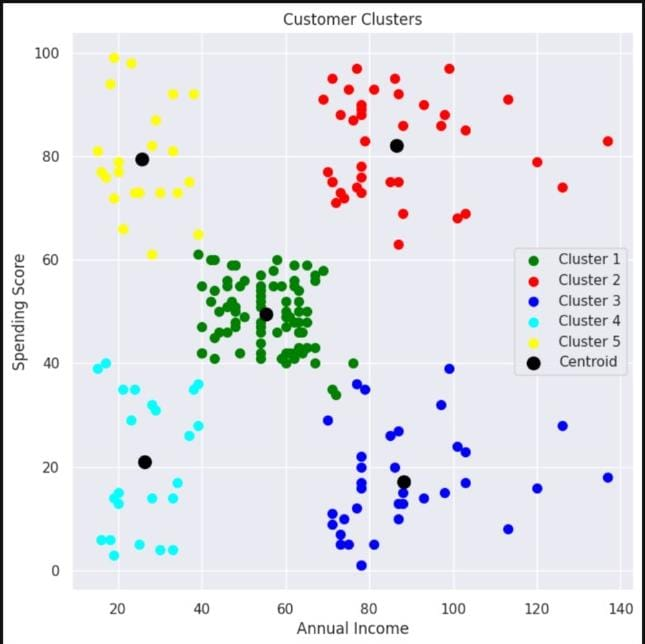
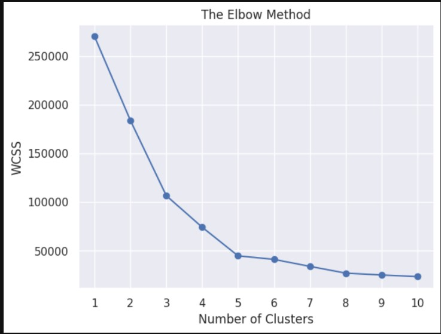

<h1 align="center">🛍️ Customer Segmentation using KMeans Clustering</h1>

<p align="center">
Segment mall customers into distinct groups based on their annual income and spending behavior using KMeans clustering. Built with Python, Pandas, and Scikit-learn.
</p>

<p align="center">
  
  
  
</p>

---

## 🧠 Problem Statement

Group customers by their income and spending scores to identify different market segments.  
This helps businesses target marketing efforts and improve customer engagement.

---

## 📊 Dataset Details

- **Name:** Mall Customer Segmentation Dataset  
- **Source:** [Kaggle - Customer Segmentation Tutorial](https://www.kaggle.com/datasets/vjchoudhary7/customer-segmentation-tutorial-in-python)  
- **Instances:** 200 customers  
- **Features:**  
  - `CustomerID`: Unique customer identifier  
  - `Gender`: Male/Female  
  - `Age`: Customer age  
  - `Annual Income (k$)`: Income in thousands of dollars  
  - `Spending Score (1-100)`: Spending behavior score  

---

## 🚀 Workflow Overview

1. **Import Libraries** – Load necessary Python packages  
2. **Load & Explore Data** – Understand dataset structure and check for missing values  
3. **Feature Selection** – Choose ‘Annual Income’ and ‘Spending Score’ for clustering  
4. **Determine Optimal Clusters** – Use Elbow Method (WCSS) to find best number of clusters  
5. **Train Model** – Fit KMeans clustering on selected features  
6. **Evaluate & Visualize** – Plot clusters and centroids to interpret customer groups  

---

## 📌 Cluster Visualization

<p align="center">
  
</p>

<p align="center">
  <em>This plot shows the 5 customer segments identified using KMeans. Each color represents a unique group, and the black dots are centroids.</em>
</p>

---

## 📈 Elbow Method

<p align="center">
  
</p>

<p align="center">
  <em>The Elbow Method helps identify the optimal number of clusters (k). The "elbow" point at k = 5 indicates the ideal number of segments.</em>
</p>

---

## 📈 Key Insights

- Customers naturally cluster into 5 groups based on income and spending.  
- Examples of clusters:  
  - High income, high spenders (ideal customers)  
  - Low income, high spenders (impulsive buyers)  
  - High income, low spenders (cautious buyers)  
  - Moderate income and spenders (average customers)  
- These insights can drive personalized marketing strategies.

---

## 💼 Business Use Case

By segmenting customers based on income and spending score, businesses can:

- Identify high-value customers
- Detect low spenders who may need retention efforts
- Personalize marketing campaigns
- Optimize product or service recommendations

---


### 📦 Installation & Setup

```bash
git clone https://github.com/Toshaksha/Machine-Learning.git
cd customer_segmentation
pip install -r requirements.txt
```

---

### 📝 How to Use

1. Open `customer_segmentation.ipynb` in **Jupyter Notebook** or **Google Colab**.
2. Run each cell in order to:

   * Load and explore the dataset
   * Perform clustering using the Elbow Method and KMeans
   * Visualize the customer segments
3. Review the output clusters and their business labels to understand customer behavior.
4. Optionally, modify the data or parameters to experiment with segmentation results.

---

## 📂 Files & Structure

```

customer-segmentation/
│
├── Mall_Customers.csv             # Dataset file
├── customer_segmentation.ipynb    # Jupyter/Colab notebook with code and visualizations
├── images/                        # Folder for saved visualizations
│   ├── elbow_plot.png
│   └── customer_clusters.png
└── README.md                      # Project documentation

```

---

## 🧰 Tech Stack

* Python 3.x  
* NumPy  
* Pandas  
* Matplotlib  
* Seaborn  
* Scikit-learn  

---

## 👤 Author

**Toshaksha** – [Github Profile](https://github.com/Toshaksha)  

Feel free to connect or reach out!

---

⭐ **If you found this project helpful, consider giving it a star!**
